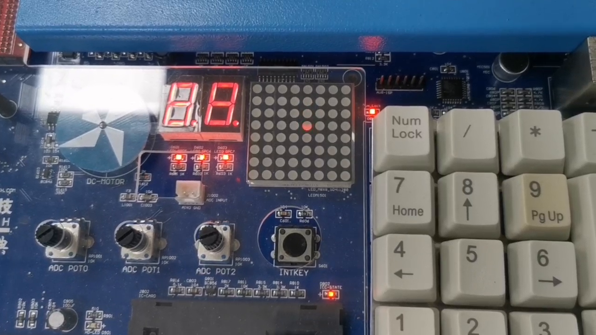
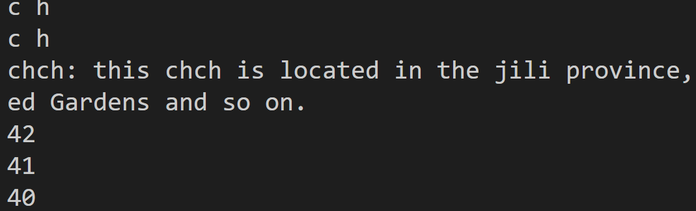
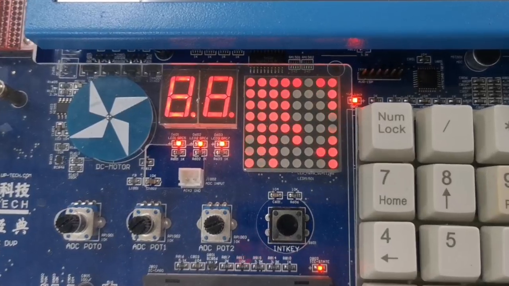
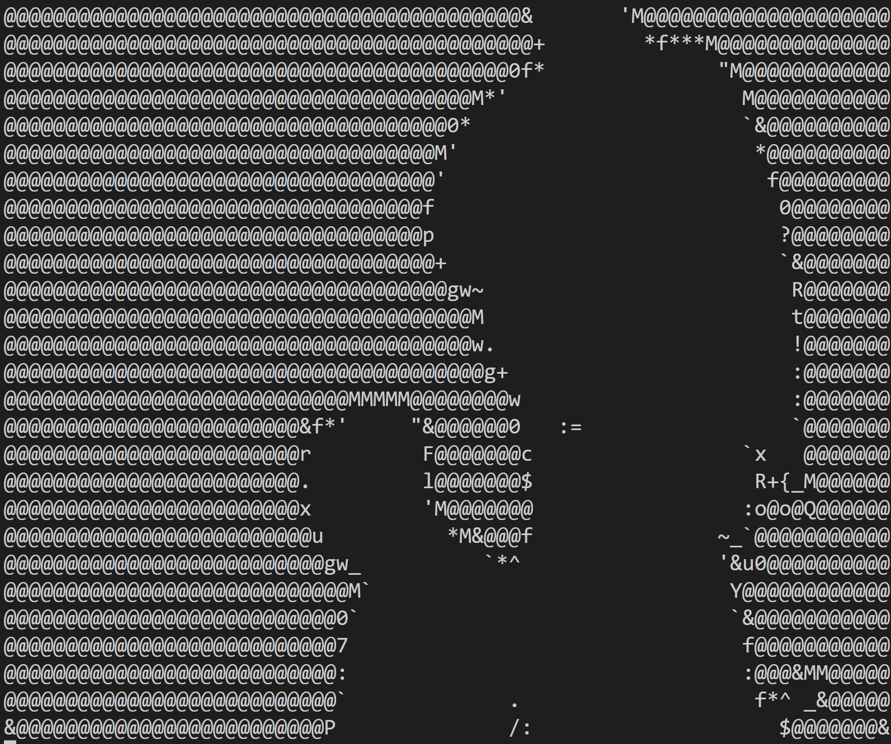

### 性能测试

#### 测试项

8x8点阵 最大帧率.

数码管 最大帧率.

#### 测试计划

##### 测试步骤

使用程序逐渐提高输出帧率.

##### 测试指标

帧之间的延迟 (单位时间).

#### 测试环境

UP-CUP-S3C2440.

#### 测试操作

##### PC

```sh
arm-linux-gcc test.c -o test.out
```

##### S3C2440

```sh
./test.out
```

#### 测试结果与分析



$1500\leqslant T_{\rm wait},$ 一切正常；
$500\leqslant T_{\rm wait}<1500,$ 有概率发生错误；
$T_{\rm wait}<500,$ 一定发生错误。

#### 总结

应该保持 $1500\leqslant T_{\rm wait}.$

### 配置文件测试

#### 测试项

配置文件正确性.

#### 测试计划

##### 测试步骤

使用程序读取并编码配置文件.

##### 测试指标

正确性.

#### 测试环境

Manjaro in modern PC.

#### 测试操作

##### PC

```sh
python test.py
```

#### 测试结果与分析



正确.

#### 总结

配置文件正确.

### 数据文件显示测试

#### 测试项

数据文件显示正确性.

#### 测试计划

##### 测试步骤

在 UP-CUP-S3C2440 上使用程序读取并显示数据文件.

##### 测试指标

正确性.

#### 测试环境

UP-CUP-S3C2440.

#### 测试操作

##### PC

```sh
arm-linux-gcc run.c -o run.out
```

##### S3C2440

```sh
./run.out
```

#### 测试结果与分析



正确.

#### 总结

数据文件显示正确.

### 数据文件生成测试

#### 测试项

数据文件生成正确性.

#### 测试计划

##### 测试步骤

在现代PC上使用程序读取, 编码并显示数据文件.

##### 测试指标

正确性.

#### 测试环境

Manjaro in modern PC.

#### 测试操作

##### PC

```sh
g++ "badapple.cpp" -o "badapple.out" -w -g -O3 -static-libgcc `pkg-config --cflags --libs 
opencv4`
chmod +x ./badapple.out
./badapple.out
```

#### 测试结果与分析



正确.

#### 总结

数据文件生成正确.
